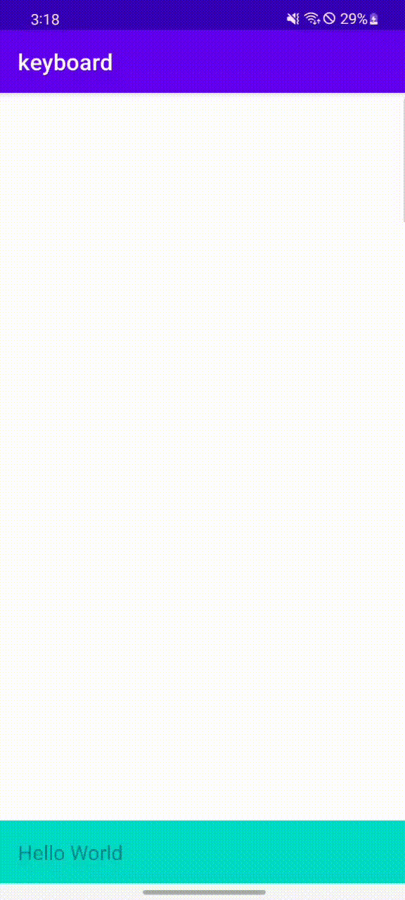

# keyboardheight
Android keyboard height change listener and support android11 keyboard height change animation

android的软键盘高度监听一直是一个老大难的问题，但是也不是完全没有解决方案，目前市面上使用的比较多的方案是：
在Window上放置一个高度为全屏，宽度为0的Popupwindow，通过监听其高度的改变来获取键盘的高度变化。

然而，在iOS系统中，键盘的高度变化非常容易获取，并且可以进行高度变化的过程监听，效果比Android好太多，这一馋哭了Android小伙伴的功能好在在Android11中也得到了支持🎉。
这个库就是将键盘的动画和非动画做了一个结合，方面使用者轻松实现自己想要的效果。

## 普通正常的健康高度改变

## Android11支持的键盘高度变化动画

